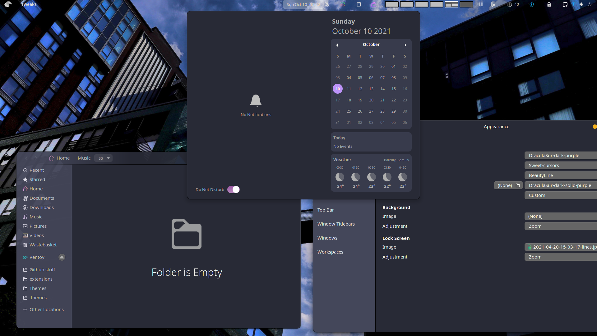

# Dracula for [GTK](https://www.gtk.org/)

> A dark theme for [GTK](https://www.gtk.org/), based on [WhiteSur](https://github.com/vinceliuice/WhiteSur-gtk-theme)

## Install

All instructions can be found at [INSTALL.MD](./INSTALL.md)
## Team

This theme is maintained by the following person(s) and a bunch of [awesome contributors](https://github.com/Aryan20/DraculaSur-gtk-theme/graphs/contributors).

 |
--- |
[Aryan Kaushik](https://github.com/Aryan20) |

## License

[MIT License](./LICENSE)
